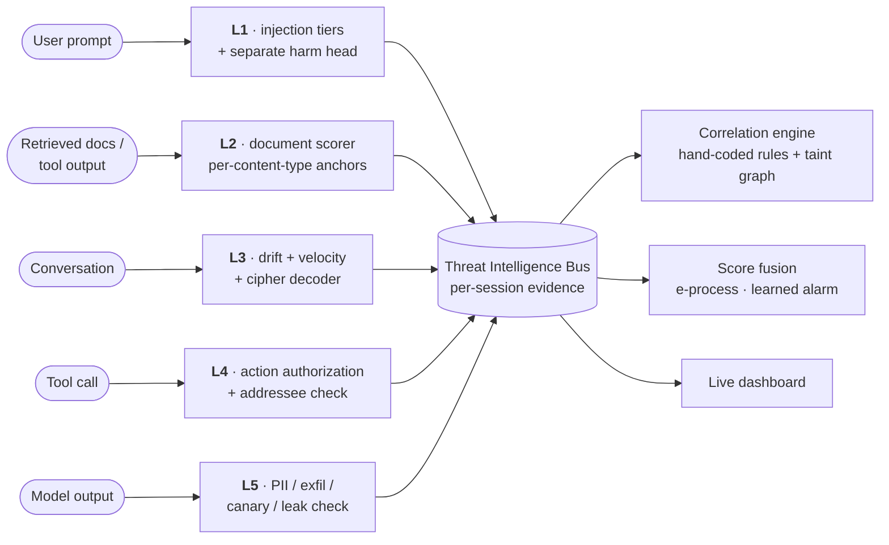

<div align="center">

# 🛡️ DIDA

### Defense-in-Depth Architecture for Secure Conversational AI

**Five security layers in front of your LLM app, plus a hard look at whether stacking them actually works.**


[What it does](#what-it-does) ·
[Results](#results) ·
[The research](#research) ·
[Architecture](#architecture) ·
[Quick start](#quick-start) ·
[Reproduce](#reproduce)

</div>

---

## ⚡ TL;DR

- 🧱 **A runtime proxy** that screens every prompt, retrieved document, conversation, tool call and model output, with calibrated thresholds and a shared per-session evidence bus.
- 🤖 **On a live Gemini agent** (AgentDojo), DIDA's tool-call check alone cuts attack success from **58.8% to 10.3%** with **zero loss** of benign task success. The full defense gets it to **4.4%**.
- 🔬 **A research result:** layered guardrails don't compose the way people assume. No detector that reads threshold crossings can catch an attacker who keeps every layer just under its threshold. And no statistically valid fusion beats the best single layer unless it assumes the layers are independent. We prove both, then show they hold on DIDA **and** on a second stack built from third-party parts (LLM Guard + Llama Guard 3).
- 📒 **Nothing hand-waved:** every number below comes from [`results.md`](results.md), the full lab log of every run, bug, fix and superseded figure.

---

<a id="what-it-does"></a>

## 🎯 The attack it was built for

> A user asks their AI assistant to *summarize a report and email it to a colleague*.
>
> 1. The retrieved report contains one sentence that looks like formatting advice. It is really a hidden instruction to forward the summary to an outside address.
> 2. Later, the assistant makes an email call whose recipient matches nothing the user typed.
>
> Neither event alone looks bad enough to block. Together, they're data exfiltration.

LLM apps now read documents, call tools and hold long conversations. That gives an attacker four doors: **the prompt, a poisoned document, a hijacked tool output, and a slow multi-turn escalation**. The industry answer is to stack guardrails. DIDA builds that stack properly, then **tests the premise instead of assuming it**.

---

<a id="results"></a>

## 📊 Results

### 🤖 Defending a live AI agent (AgentDojo)

A real Gemini agent doing real tasks (email, banking, travel, Slack) while attackers plant instructions in its tool outputs. 68 attack scenarios and 34 benign tasks; every pipeline ran every episode.

| Pipeline | Attack success ↓ | Task success under attack ↑ | Task success, no attack ↑ |
|---|:---:|:---:|:---:|
| No defense | 0.588 | 0.529 | 0.853 |
| AgentDojo's built-in detector | 0.015 | 0.206 | 0.471 |
| **DIDA, tool-call check only** | **0.103** | **0.574** | **0.853** |
| **DIDA, full** | **0.044** | 0.309 | 0.794 |

> ✅ **The tool-call check alone cuts attacks about 6× and keeps benign task success exactly the same.**
> The full defense stopped 37 attacks and enabled none (p < 10⁻⁶). AgentDojo's own detector gets its low number by breaking **13 of 34** benign tasks.

### 🧱 Every layer, shipped configuration

| Layer | Stops | Benchmark | Result |
|---|---|---|---|
| **L1** injection | prompt injection | TensorTrust (570 attacks) | recall **0.875** |
| | | NotInject / Alpaca (benign) | false positives **3.5% / 0.5%** |
| **L1H** harm intent | jailbreaks hidden in roleplay | WildJailbreak (2,210) | AUROC **0.952**, recall 0.738 @ 4.3% FPR |
| **L2** documents | poisoned retrieval | BIPIA | AUROC **0.928**; held-out recall **0.636** @ **1.3%** FPR |
| **L3** multi-turn | slow-burn and cipher jailbreaks | tom-gibbs (5,336) | AUROC **0.996**, recall 0.984, **0 false positives** |
| **L4** tool calls | agent hijacking | InjecAgent | recall **1.000**, **0 false positives** |
| **L5** output | data leakage | AgentLeak (5,006) | AUROC **0.888** |
| **Pipeline** | multi-vector attacks | DIDA-Bench | **91.5%** blocked, **0** false positives |

### 🔧 What the engineering bought

Each row is a measured root cause and a repair, not a threshold tweak.

| Problem found | Before | After |
|---|:---:|:---:|
| Harmful intent hidden in roleplay (WildJailbreak AUROC) | 0.574 | **0.952** |
| Cipher-encoded multi-turn jailbreaks (tom-gibbs AUROC / FPR) | 0.755 / 10.2% | **0.996 / 0%** |
| Poisoned documents (BIPIA AUROC) | 0.719 | **0.928** |
| Poisoned documents (BIPIA held-out recall @ FPR) | 0.148 @ 4.0% | **0.636 @ 1.3%** |
| Agent hijacking, trace replay (attack execution per suite) | 0.59 / 1.00 / 0.45 / 0.41 | **0.00 / 0.20 / 0.02 / 0.00** |
| Tool-call false alarms on benign agent traffic | 56% of calls | **2–20%** by suite |
| Injection false positives on trigger-word prompts (NotInject) | 11.5% | **3.2%** (judge off) |
| Full-pipeline blocking on DIDA-Bench (0 false positives) | 69.5% | **91.5%** |

### 🥊 Against third-party guards

| | Llama Guard 3 (1B) | ProtectAI DeBERTa v2 | DIDA |
|---|:---:|:---:|:---:|
| WildJailbreak AUROC | 0.814 | 0.653 | **0.952** |
| Multi-turn attacks (MHJ vs. real chats), AUROC | 0.682 | 0.566 | 0.682 (L3); 0.954 (probe, not shipped) |
| Certified sub-threshold sessions caught (SPLIT-Bench v1) | 1 / 340 | 0 / 340 | **265 / 340** (L3) |
| TensorTrust recall | 0.588 | **0.970** | 0.875 |
| False positives on NotInject | 7.4% | 43.4% | **3.5%** |

ProtectAI wins TensorTrust at its default threshold, but it flags 43% of benign trigger-word prompts. Held to DIDA's false-positive rate, its recall falls to 0.779.

---

<a id="research"></a>

## 🔬 The research: do layered defenses compose?

Short answer: **not the way the industry assumes.**

| # | Finding | Evidence |
|:---:|---|---|
| 1 | **Threshold fusion is provably blind** to an attacker who keeps every layer under its threshold | The correlation engine fired **0 times** on SPLIT-Bench v1 (680 sessions) and v2 (510), whose sessions carry machine-checked sub-threshold certificates |
| 2 | **Apparent cross-layer wins are single layers in disguise** | The only mechanism that detected anything, a pattern miner (\|U\| 0.7794 / 0.6706), equals one layer's zero-false-positive ceiling *exactly* |
| 3 | **Valid fusion can't beat the best layer** without assuming independence | An anytime-valid e-process detects a set **identical** to one layer's (Jaccard 1.0000). A learned alarm ranks attacks at AUROC 0.974 but can't operate within a 2% false-alarm budget |
| 4 | **Pipelines destroy evidence at their interfaces** | A four-check audit found **7** such points in DIDA. Llama Guard's safe/unsafe verdict turns an AUROC-0.714 ranking into a single bit (0.500) |
| 5 | **It's not just our system** | Replicated on LLM Guard + Llama Guard 3 with a corpus certified against *that* stack: the deployed rule catches **0/107**, dependence-robust fusion **0**, independence-assuming fusion **10**, exactly as predicted |
| 6 | **More layers can mean more places to hide** | 66.7–85.2% of DIDA's headroom is undefended against a distributed attacker (37.4% on the third-party stack) |

The math is classical: decision fusion, and Vovk and Wang's e-merging. The contribution is turning it into **checks an engineer can run on a real guardrail stack**, and measuring two stacks against them.

---

<a id="architecture"></a>

## 🏗️ Architecture



| Layer | How it works |
|---|---|
| **L1** | Regex → semantic templates → Prompt Guard × PIGuard (an AND, which kills trigger-word false positives) → an optional policy judge (gpt-oss-safeguard-20b). Plus a **separate** harm-intent head (Qwen3Guard): fusing it in with `max()` measurably hurt both signals. |
| **L2** | Prompt Guard's *injection* head over overlapping segments, plus a dangerous-code indicator, with Mondrian split-conformal anchors per content type (news, code answers, tool outputs). Short text is scored by PIGuard. |
| **L3** | Alignment, cumulative drift and velocity over sentence windows. For substitution-cipher jailbreaks it reverse-substitutes the conversation and scores the **decoded goal** instead of the encoding. |
| **L4** | Every tool has a capability class. The user must have asked for the action, and every argument is traced back to where it came from. The **addressee check** asks whether the text around a copied value is *talking to the AI*: emails and chats instruct humans, injections instruct the model. |
| **L5** | PII and exfiltration patterns, canary tokens (including base64), and a provenance leak check that reuses L4's tracing on the output. |

🎚️ Thresholds are **split-conformal, calibrated on benign data only**, so the false-positive rate is guaranteed on traffic like the calibration set. We also report where that guarantee breaks across corpora.

---

## ✨ Engineering highlights

| | |
|---|---|
| 📜 **Certified benchmarks** | A SPLIT-Bench sample is accepted only if a machine-checked certificate proves every layer is under its threshold while at least *k* layers carry signal. Certificates are re-verified at import. |
| 🕵️ **Suspicious of good numbers** | Seven harness defects were caught by treating plausible results as suspect. Examples: a leak benchmark that shared one session across samples (AUROC 0.53 → 0.89 once fixed), and an agent framework that counted an overloaded API as a *successful attack*. |
| 🔒 **Pre-registered gates** | Candidate improvements were adopted only if they passed a gate written before the held-out data was scored. Several failed, and they're reported as failures. |
| 💻 **Runs on a laptop** | Qwen3Guard and Llama Guard run on a 4 GB GPU via split-device placement, matching CPU scores to within 5×10⁻⁶. With the judge off, the whole defense runs locally. |
| 🗂️ **Every run recorded** | Each evaluation saves its full configuration snapshot, indexed in `sentinel/eval/results/LEDGER.jsonl`. |

---

<a id="quick-start"></a>

## 🚀 Quick start

```bash
pip install -r requirements.txt           # the proxy
cp .env.example .env                      # optional API keys (see below)
python main.py                            # proxy + live dashboard → http://localhost:8080
```

- **Python 3.10+.** A GPU is optional.
- **Gated models:** Prompt Guard and Llama Guard 3 need their Hugging Face licences accepted (`huggingface-cli login`).
- **Optional keys:**
  - `GROQ_API_KEYS` enables L1's policy judge. Set `L1_LLM_JUDGE_ENABLED=false` for a fully local defense.
  - `GEMINI_API_KEYS` is used only by the live AgentDojo harness and the benign-data audit.

### 🔌 Core endpoints

| Method | Endpoint | Purpose |
|---|---|---|
| `POST` | `/sentinel/chat` | screen user input |
| `POST` | `/sentinel/rag/ingest` | screen a document before retrieval |
| `POST` | `/sentinel/agent/tool_call` | authorize a tool call before it runs |
| `POST` | `/sentinel/agent/tool_response` | scan a tool output |
| `POST` | `/sentinel/output/scan` | scan a model response |
| `WS` | `/ws/events` | live event stream |

---

<a id="reproduce"></a>

## 🧪 Reproducing the results

```bash
pip install -r requirements-eval.txt
python -m sentinel.eval.runner --layer L1 --dataset tensortrust       # any layer × dataset
python -m sentinel.eval.runner --pipeline                             # full pipeline, DIDA-Bench
python -m sentinel.eval.split_bench                                   # generate certified SPLIT-Bench
python -m sentinel.eval.eprocess_eval                                 # anytime-valid fusion
python -m sentinel.eval.agentdojo_l4 --attacks --max-pairs 60         # L4, trace replay
python -m sentinel.eval.agentdojo_live --pairs 20 --benign 10         # live agent (resumable)
python -m sentinel.eval.guard_baseline --backend llama-guard-3-1b     # third-party baselines
python -m sentinel.eval.second_stack build && python -m sentinel.eval.second_stack analyze
```

## 📁 Repository layout

```
main.py                    entry point
sentinel/                  the DIDA package (directory keeps the project's original name)
├── app.py                 FastAPI proxy and WebSocket
├── config.py              every threshold and feature flag, shipped defaults documented inline
├── core/                  threat bus, correlation, taint graph, e-value fusion, conformal calibration,
│                          addressee cues, split-device GPU placement
├── layers/                L1 · L2 (layer2_rag/) · L3 · L4 (layer4_agentic/) · L5 (layer5_output/)
└── eval/                  harness, dataset loaders, SPLIT-Bench generator + certificates,
    └── data/              live AgentDojo, guard baselines, second-stack audit; our benchmarks
dashboard/static/          real-time monitoring dashboard
results.md                 the complete lab log
```

Third-party corpora (AgentDojo, InjecAgent, BIPIA, AgentLeak, WildJailbreak, MHJ, tom-gibbs, OR-Bench, WildChat, OpenAssistant) are fetched from their sources by `sentinel/eval/dataset_loaders.py` and are not redistributed. Neither is any corpus containing real users' conversation text.

---

<div align="center">

**Built by Gokul Iyer**

</div>
